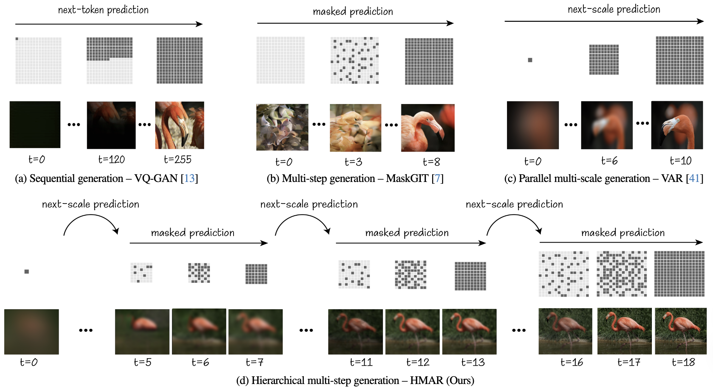

# <p align="center">HMAR: Efficient <u>H</u>ierarchical <u>M</u>asked <u>A</u>uto<u>R</u>egressive Image Generation </p>

<p align="center">
  <b>Hermann Kumbong, Xian Liu, Tsung-Yi Lin, Xihui Liu, Ziwei Liu, Daniel Y Fu, Ming-Yu Liu, Christopher Re, David W. Romero</b>
</p>

<div align="center">

[](https://arxiv.org/abs/2506.04421)&nbsp;
[](https://huggingface.co/nvidia/HMAR)&nbsp;
[](https://research.nvidia.com/labs/dir/hmar/)&nbsp;
</div>

<figure align="center">
    
    <figcaption align="center"><b>HMAR Samples</b>: Class-conditional ImageNet generated samples at 256×256 and 512×512 resolutions.</figcaption>
</figure>

## Method Overview

<p align="center">

<p>
  
## Install

Ensure `torch>=2.0.0` with CUDA is installed.

```bash
# clone
git clone https://github.com/Kumbong/HMAR
cd HMAR

# install dependencies
pip install -r requirements.txt

# Download the vqvae tokenizer from VAR
wget https://huggingface.co/FoundationVision/var/resolve/main/vae_ch160v4096z32.pth

# Turn on triton autotuning to ensure kernels are tuned for specific hardware
export TRITON_AUTO_TUNING=1
```

## Training
Prepare the [ImageNet](https://cloud.google.com/tpu/docs/imagenet-setup) dataset. It should be in a path `/path/to/imagenet` with subfolders `train` and `validate`.

Train HMAR-{d16, d20, d24, d30, d36-s} on ImageNet 256x256 or 512x512, for next-scale prediction. 

```bash
# d16, 256x256, for d20, d24, d30 etc, change the experiment accordingly
torchrun --nproc_per_node=8 --nnodes=... --node_rank=... --master_addr=... --master_port=... train.py  --experiment=hmar-train-d16 --data_path='/path/to/imagenet'
```
**NOTE**:  We provide training configs in e.g `config/experiment/hmar-train-d16.yaml`.


## Finetuning
 
Introduce masked prediction and combine it with next-scale prediction in HMAR-{d16, d20, d24, d30, d36-s} on ImageNet 256x256 or 512x512.

```bash
# d16, 256x256, for d20, d24, d30 etc, change the experiment accordingly
torchrun --nproc_per_node=8 --nnodes=... --node_rank=... --master_addr=... --master_port=... train.py  --experiment=hmar-finetune-mask-d16 --data_path='/path/to/imagenet'
```
**NOTE**:  We provide finetuning configs in e.g `config/experiment/hmar-finetune-mask-d16.yaml`.

## Sampling

We provide a sampling script `sample.py` to generate images with HMAR.

```bash
# 1) you can change the sampling configs from config/sampling/hmar-d30.yaml
# 2) you can change the number of masked sampling steps from utils/sampling_arg_util.py 
python sample.py --checkpoint=hmar-d30
```

## Evaluation
 
To compute FID, Inception Score, Precision and Recall, or to reproduce the numbers from our paper

```bash
# generate 50K samples to be used for evaluation 
python -m evaluate.generate_samples --checkpoint=hmar-d16

# compute FID, IS, precision, recall on the generated samples
python -m evaluate.compute_metrics --checkpoint=hmar-d16
```

## Benchmarking

To benchmark the attention kernels, e2e training and inference speedups, or reproduce the efficiency numbers reported in our paper. 

```bash
# Ensure that triton kernels are tuned for specific hardware
export TRITON_AUTO_TUNING=1

# stand alone attention kernels performance
python -m benchmark.attention --sparsity_pattern="block_diagonal"

# end-to-end training performance 
python -m benchmark.training

# inference performance
python -m benchmark.inference
```

We report numbers on `A100 80Gb SXM4`, `CUDA Version: 12.5` and `triton 3.2.0`

## Acknowledgement
We would like to acknowledge the following projects, from which code in this codebase has been derived:
* [VAR](https://github.com/FoundationVision/VAR) 
* [MaskGIT](https://github.com/google-research/maskgit).

## Citation
```bibtex
 @article{kumbong2024hmar,
            title     = {HMAR: Efficient Hierarchical Masked AutoRegressive Image Generation},
            author    = {Kumbong, Hermann and Liu, Xian and Lin, Tsung-Yi and Liu, Xihui and Liu, Ziwei and Fu, Daniel Y and Liu, Ming-Yu and Re, Christopher and Romero, David W},
            journal   = {Proceedings of the IEEE/CVF Conference on Computer Vision and Pattern Recognition (CVPR)},
            year      = {2025},
            url       = {https://arxiv.org/abs/2506.04421}
          }
```
